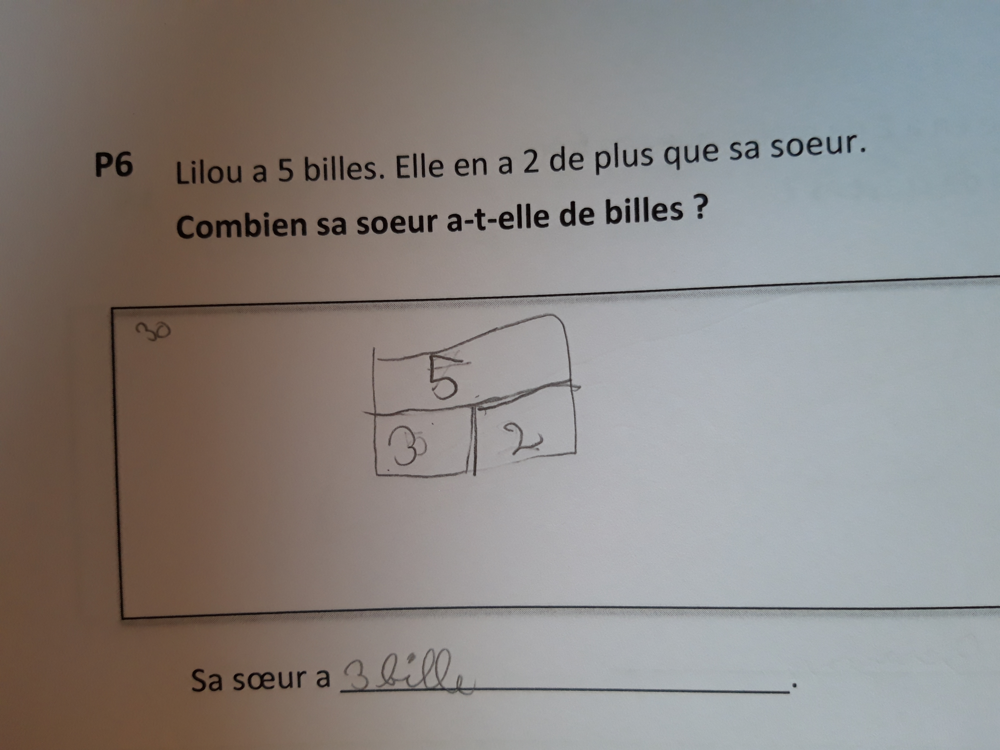
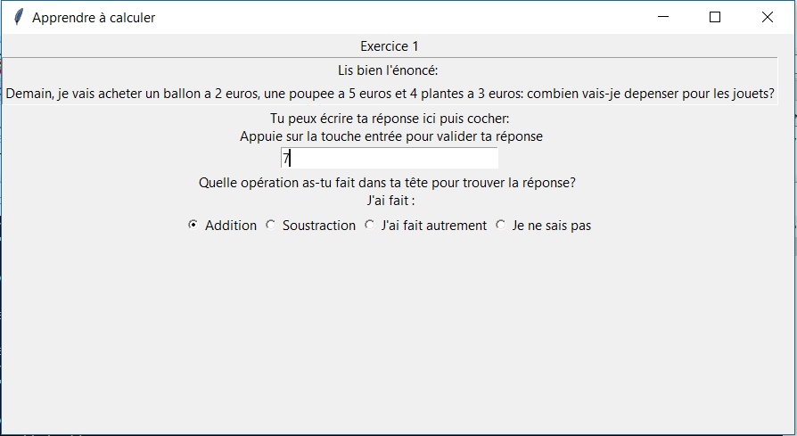
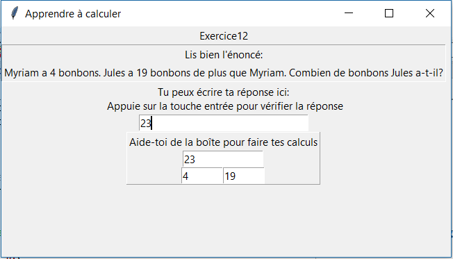

# PCBS Résolution de problèmes

Le but de ce projet est de proposer une application permettant à des élèves de CP/CE1 de faire des exercices pour progresser en mathématiques et plus particulièrement en résolution de problèmes. Je m'appuie pour cela sur le cadre théorique et les exercices proposés aux enfants dans le cadre de mon stage.

## Cadre théorique : Un nouvelle manière d'apprendre les mathématiques
J'utilise ici une partie de la pédagogie que j'ai étudiée lors de mon stage. Le but est de travailler des problèmes qui demandent un recodage sémantique plus important, c'est à dire des problèmes moins intuitifs qui sont dits incongruents. L'incongruence peut se manifester de plusieurs façons : l'incongruence sémantique ou l'incongruence procédurale.

* L'incongruence sémantique provient du fait que la sémantique utilisé dans l'énoncé n'est pas en accord avec la représentation mathématiques et le calul à effectuer. Ce sont par exemple des problèmes qui font apparaître les notions "De plus", "De moins".Par exemple, pour des problèmes contenant les mots "De plus", les élèves ont tendance à vouloir faire une addition. Or dans un exemple comme : "Lilou a 5 billes. Elle en a 2 de plus que sa soeur. Combien sa soeur a-t-elle de billes ?", il faut faire une soustraction pour répondre correctement.

* L'incongruence procédurale concerne l'efficacité de la simulation mentale et joue par exemple sur la disymétrie des termes et la commutativité de l'addition par exemple. En effet, il a été montré que les mots utilisés et l'ordre des nombres présentés influencent la stratégie que va utiliser l'élève.

Tous ces problèmes sont appelés problèmes à énoncé verbal incongruent. Les deux autres catégories que j'utilise sont des problèmes à énoncé congruent (ou items classiques), et des problèmes qui visent à tester le niveau de langage et de compréhension de l'élève.

Un des outils développés pour favoriser un meilleur encodage sémantique et une meilleure compréhension du problème est la boîte, en image ci dessous.

<figure>
    
</figure>

Elle contient trois cases: la case du dessus représentant le tout, et les deux cases du dessous les deux parties qu'il faut additionner pour obtenir le tout. Cette boîte sert à mieux identifier le problème et à pouvoir visualiser l'opération à effectuer. Elle sera proposée aux élèves lors de la phase d'entrainement.

## Programmation de l'application
J'utilise trois scripts principaux dans mon projet:

* Le premier [PCBS_pretest_calcul.py](https://github.com/JoannaStierlin/PCBS_Resolution_de_problemes/blob/master/PCBS_pretest_calcul.py) est une phase de test pour évaluer les compétences de l'élève, que je sépare en trois catégories: langage, items classiques et items incongruents (c'est à dire des items pour lesquels l'énoncé verbal est incongruent- voir ci-dessus pour l'explication).

Voici un exemple de l'application dans lequel l'élève répond à une question du prétest. Deux actions lui sont demandées: répondre à la question puis expliciter si possible sa stratégie.
<figure>
    
</figure>

* Le deuxième script [PCBS_statistiques_initiales_eleve.ipynb](https://github.com/JoannaStierlin/PCBS_Resolution_de_problemes/blob/master/PCBS_statistiques_initiales_eleve.ipynb) est destiné à l'enseignant et a pour but de faire un compte rendu statistique des compétences de l'élève ainsi que des stratégies qu'il utilise. Ces statistiques peuvent être utiles à l'enseignant qui peut alors voir les domaines où l'élève a encore des progrès à faire. Il servira aussi dans le troisième script car il définit les poids de départ de chaque catégorie de questions pour la phase d'apprentissage.

Voici le genre de graphique auxquels on a accès après l'analyse des données:
<figure>
    
</figure>

* Le troisième [PCBS_apprendre_a_calculer.py](https://github.com/JoannaStierlin/PCBS_Resolution_de_problemes/blob/master/PCBS_apprendre_a_calculer.py) est la phase d'apprentissage pendant laquelle l'élève s'entraine sur des problèmes. Il peut, pour s'aider, utiliser des outils comme la boite proposés par la méthode Arithmécole sur laquelle j'ai travaillé pendant mon mini-stage.
A chaque catégorie d'items est attribué un poids qui correspond à l'importance de la catégorie dans les questions proposées. Plus le poids est grand, et plus l'élève doit travailler cette catégorie. C'est une tâche d'apprentissage adaptative donc les poids se modifient en fonction des réponses de l'élève.

Voici un exemple de l'application dans lequel l'élève répond après avoir utilisé la boîte:
<figure>
    
</figure>

Dans les premiers et troisièmes scripts, j'utilise la libraire tkinter, qui me permet de créer une interface graphique. Le principe de cette librairie est d'utiliser des widgets placés dans des fenêtres. Lorsque l'utilisateur intéragit avec les widgets pour effectuer une action, cela enclenche les fonctions définies au début du code.

### Phase de test
Je présente dans cette partie les fonctions importantes du programme [PCBS_pretest_calcul.py](https://github.com/JoannaStierlin/PCBS_Resolution_de_problemes/blob/master/PCBS_pretest_calcul.py). Dans cette application, l'élève répond et ses réponses sont enregistrées. On enregistre pour chaque question le numéro de l'exercice, le type d'item (Langage, Classique ou Incongruent), la correction de l'exercice (donnée par le fichier d'entrée), la réponse de l'élève et la stratégie qu'il utilise. Il n'obtient pas de feedback sur ce qu'il répond, le but étant juste de tester son niveau.
Voici à quoi ressemble mon interface graphique:

La fonction continuertest permet de passer à la question suivante et d'enregistrer les réponses de la question actuelle.

    def continuertest(reponse):
        global numero_exercice

        reponse_question=[exercices[numero_exercice][numexo]+"\t",
                          exercices[numero_exercice][typeitem]+"\t",
                          exercices[numero_exercice][corexo]+"\t",
                          entree.get()+"\t",
                          CheckVar1.get()+"\n"]
        donnees_eleve.writelines(reponse_question)
        entree.delete(0,END)
        entree.grid_forget()
        cadre3.grid_forget()
        numero_exercice+=1

        if numero_exercice==nbexercices:
            quitter.grid(column=0, row=5)
            donnees_eleve.close()

        else:
            etape_suivante.grid(column=0,row=8)

Il y a ensuite une deuxième question qui me permet de modifier la fenêtre graphique pour passer à l'étape suivante. Cette fonction est actionnée par un bouton qui se nomme etape_suivante.

    etape_suivante=Button(fenetre, text="On continue!", command=exercicesuivant)

    def exercicesuivant():
        entree.grid(column=0,row=3)
        cadre3.grid(column=0,row=3)
        etape_suivante.grid_forget()

        Num_Exo.configure(text=exercices[numero_exercice][numexo])
        consigne2.configure(text=exercices[numero_exercice][consigne])

La fin de mon script sert à définir les différents widgets ainsi que leur emplacement dans la fenêtre (on définit pour cela différents cadres).

### Statistiques de l'élève
Voir le Notebook [PCBS_statistiques_initiales_eleve.ipynb](https://github.com/JoannaStierlin/PCBS_Resolution_de_problemes/blob/master/PCBS_statistiques_initiales_eleve.ipynb)

### Phase d'entrainement
Ce programme [PCBS_apprendre_a_calculer.py](https://github.com/JoannaStierlin/PCBS_Resolution_de_problemes/blob/master/PCBS_apprendre_a_calculer.py) code pour la phase d'entrainement et constitue le coeur du projet.
Ce programme ressemble au premier programme de test, sauf qu'il renvoie des feedbacks à l'élève et passe à la question suivante uniquement lorsque l'élève trouve la bonne réponse. Les questions sont à nouveau séparées en trois catégories : Langage, Classique, Incongruent. Chacune des trois catégories est associée à un poids qui correspond à l'importance de cette catégorie pour l'enfant dans la phase d'entrainement. Plus le poids est élevé et plus l'enfant devra faire face à des questions de cette catégorie. C'est une tache adaptative, dans laquelle la réponse de l'enfant modifie le poids attribué à chaque catégorie.

Mon programme commence avec une fonction qui calcule le poids de chaque catégorie:
    def normaliser(liste_poids):
        total=sum(liste_poids)
        liste_poids[0]=liste_poids[0]/total
        liste_poids[1]=liste_poids[1]/total
        liste_poids[2]=liste_poids[2]/total

Il y a ensuite une fonction de test qui permet de corriger la réponse de l'élève. Comme c'est une tâche adaptative, on modifie les poids après chaque réponse de l'élève : si la réponse est fausse, on augmente le poids de la catégorie de 0.1, puis on renormalise le tout grâce à la fonction ci-dessus. Si la réponse est correcte, on passe à la question suivante sans modifications.

    def estjuste(reponse):
        global numero_exercice
        global categorie

        if entree.get()==exercices[numero_exercice][corexo]:
            correction.configure(text="Bravo, c'est la bonne réponse!")

            entree.grid_forget()
            bouton_boite.grid_forget()
            etape_suivante.grid(column=0,row=3)

        else:
            correction.configure(text="Essaie encore, tu ne dois pas être loin!")
            correction.grid(column=0,row=2)

            poids[categorie]+=0.1  #changer les poids a la categorie car la personne s'est trompee
            normaliser(poids)

Puis une autre fonction qui permet de passer à la question suivante dans le cas où la réponse était correcte:

    def exercicesuivant():
        global numero_exercice

        entree.delete(0,END)
        entree.grid(column=0,row=1)
        etape_suivante.grid_forget()
        correction.grid_forget()

        supprimerboite()
        bouton_boite.grid(column=1, row=5)

        numero_exercice=choisir_exercice(poids)
        Num_Exo.configure(text=exercices[numero_exercice][numexo])
        consigne2.configure(text=exercices[numero_exercice][consigne])

On utilise la fonction ci-dessous pour choisir l'exercice suivant aléatoirement en fonction des poids attribués aux différentes catégories.

    def choisir_exercice(liste_poids):
        global categorie
        numero_choisi=0
        nb_alea=random.random()

        numero_debut_classique=nb_exo_par_cat[0]
        numero_debut_incongruent=nb_exo_par_cat[0]+nb_exo_par_cat[1]
        if nb_alea <liste_poids[0]:
            numero_choisi=random.randint(0,numero_debut_classique-1)
            categorie=0
        elif liste_poids[0]<=nb_alea<liste_poids[0]+liste_poids[1]:
            numero_choisi=random.randint(numero_debut_classique, numero_debut_incongruent-1)
            categorie=1
        else:
            numero_choisi=random.randint(numero_debut_incongruent,numero_debut_incongruent+nb_exo_par_cat[2]-1)
            categorie=2
        return numero_choisi

Enfin, les deux dernières fonctions me permetttent de gérer l'affichage et la suppression de la boite en fonction des besoins.

    def afficherboite():    
        bouton_boite.grid_forget()

        aideboite.grid(column=0, row=0, columnspan=2)
        tout.grid(column=0,row=1, columnspan=2)
        partie1.grid(column=0,row=2,sticky='e')
        partie2.grid(column=1,row=2,sticky='w')

    def supprimerboite():
        aideboite.grid_forget()

        tout.delete(0,END)
        partie1.delete(0,END)
        partie2.delete(0,END)

        tout.grid_forget()
        partie1.grid_forget()
        partie2.grid_forget()

Comme dans le premier script, la fin du programme sert à programmer l'affichage de la fenêtre et de tous les widgets qu'il contient.

## Conclusion
Ces programmes pourraient être utiles à la méthode Arithmécole pour plusieurs raisons.

Premièrement, la phase de test aurait permis de tester la méthode Arithmécole et de récolter les données de chaque élève dans un fichier, ce qui est un avantage non négligeable car j'ai passé une partie de mon temps à coder les données de test lors de mon stage. Cependant pour ce type de tâche, faire un test sur ordinateur ou sur papier peut donner des résultats différents, car les élèves passaient souvent aussi par des dessins pour modéliser les problèmes. Réfléchir devant un oridnateur ou devant une feuille est un petit peu différent.

De plus, la phase d'analyse des résultats permettrait d'avoir un suivi précis et individualisé de l'élève et de savoir où il en est dans ses apprentissages.

Enfin, la phase d'entrainement pourrait être utile pour faire travailler les élèves en fonction de leurs besoins, tout en leur proposant les aides introduites par la méthode Arithmécole.

### Les limites et améliorations possibles
J'aurais pu aller plus loin dans la phase d'entrainement et demander aux élèves le calcul qu'ils on effectué pour obtenir leur résultat. En effet, la stratégie utilisée nous en apprend plus sur la compréhension et la modélisation du problème par l'élève que le résultat du calcul, qui peut contenir des erreurs. Le but de cette méthode est avant tout d'améliorer la compréhension des élèves et leurs capacités de simulation mentale et non d'améliorer les capacités calculatoires. De même, j'aurais pu ajouter une fonction qui renvoie des feedbacks sur l'utilisation de la boite.

Je n'ai qu'un nombre restreint de questions, il faudrait proposer plus de problèmes analogues. Dans l'idéal, le programme devrait s'arrêter lorsque les poids restent stationnaires, c'est à dire lorsque l'élève ne fait plus d'erreurs (parce qu'il a compris et non parce qu'il connait les exercices par coeur!).
